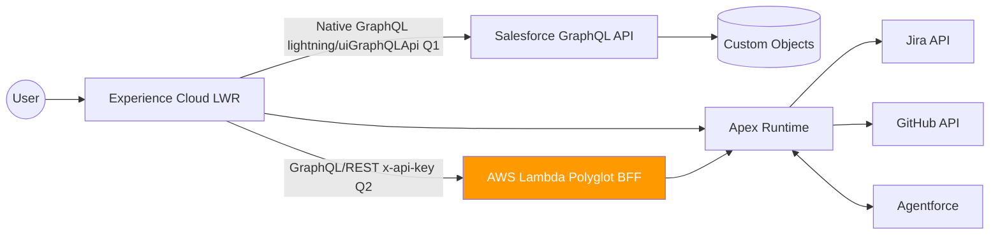

# Ryan Bumstead — Salesforce Platform Architect Portfolio

[](https://github.com/rdbumstead/salesforce-platform-architect-portfolio/actions/workflows/deploy.yml)
[](https://github.com/rdbumstead/salesforce-platform-architect-portfolio/actions/workflows/pr.yml)
[](https://github.com/rdbumstead/salesforce-platform-architect-portfolio/actions/workflows/keep-alive.yml)
[](https://linkedin.com/in/ryanbumstead)
[](https://www.salesforce.com/trailblazer/rbumstead)
[](https://www.salesforce.com/trailblazer/rbumstead)
[](mailto:ryan@ryanbumstead.com)
[](LICENSE)

**Live Site** -> [https://ryanbumstead.com](https://ryanbumstead.com) (placeholder page)  
**Full MVP Launch** -> Q1 2026  
**Phase 8 Multi-Cloud** -> Q2 2026

> All architecture documentation is complete.  
> MVP implementation began December 2025 and ships Q1 2026.

**Quick note for non-Salesforce readers** This is a full enterprise-grade system built on Salesforce (the #1 CRM platform). Think of it as a public web app with real-time data, AI-generated content, and strict DevOps — all running on Salesforce's cloud. The design is finished today; the code is being built now.

**Contact:** [LinkedIn](https://linkedin.com/in/ryanbumstead) | ryan@ryanbumstead.com

---

## What This Portfolio Demonstrates (for Hiring Managers)

This project showcases Principal-level Salesforce Platform Architecture:

- **End-to-end multi-cloud systems design** (LWR + $0.00-forever Lambda BFF)
- **Enterprise DevOps** (delta deploys, quality gates, scratch org automation)
- **API-first architecture** (OpenAPI spec + Twin API pattern)
- **Applied AI governance** (triple-fallback inference, grounding strategy, safety envelopes)
- **Full enterprise documentation suite** (SAS, Charter, Technical Guide, Ops Guide)
- **8 Salesforce certifications** including AI Associate, Agentforce Specialist, and Data Cloud Consultant

---

## Status at a Glance

| Item               | Status          | Notes                                    |
| :----------------- | :-------------- | :--------------------------------------- |
| Architecture Docs  | Complete        | 6 full enterprise guides                 |
| CI/CD Pipelines    | Active          | Delta deploys + PMD + coverage           |
| MVP Code           | In Development  | Launching Q1 2026                        |
| Phase 8 Lambda BFF | Design Complete | Multi-cloud features deferred to Q2 2026 |

## Core Features (Enterprise-Grade)

- **Triple-fallback AI inference pipeline** ([ADR-021](docs/guides/03-SAS.md#adr-021-ai-inference-fallback-stack))
- **Native Salesforce GraphQL skill network** via `lightning/uiGraphQLApi`
- **Twin API pattern** with full OpenAPI 3.0 specification ([ADR-024](docs/guides/03-SAS.md#adr-024-twin-api-pattern))
- **Real-time Glass Box telemetry** for governor limits ([ADR-014](docs/guides/03-SAS.md#adr-014-deferred-telemetry-loading))
- **Delta deployments** via `sfdx-git-delta` + GitHub Actions
- **$0.00 forever multi-cloud BFF** ([ADR-018](docs/guides/03-SAS.md#adr-018-finops-constraint--aws-lambda-function-urls-vs-api-gateway))

## For Hiring Managers & Technical Evaluators

> **Note:** The live portfolio site is under active development and will launch in **Q1 2026**. Until then, please evaluate this architecture through its documentation, design decisions, and CI/CD discipline.

Once the MVP is live, you will be able to verify hands-on skills through these interactive demonstrations:

### MVP Features (Live Q1 2026)

- **Test Resilience Engineering**: Toggle the "Resilience Simulation" switch in the Glass Box footer to watch GitHub/Jira integrations fail gracefully while the UI serves cached data. Proves circuit breaker patterns and enterprise HA design.
- **Validate API-First Architecture**: Use the API Tester component to call native Salesforce REST endpoints. Compare responses against the OpenAPI spec and check for mandatory headers like `X-Request-Id`.
- **Verify Observability**: Monitor real-time Salesforce governor limits (Heap, CPU) and AI provider health in the "Glass Box" footer. Proves production-grade monitoring and constraint-aware development.
- **Evaluate Mobile-First Performance**: View the site on mobile to trigger the static SVG fallback for the skill graph. Proves performance budgeting (LCP < 2.5s) and WCAG compliance.

### Phase 8 Multi-Cloud Features (Target State — Q2 2026)

- **Multi-Cloud API Gateway**: AWS Lambda Function URL BFF (Door 2) designed to reduce payload by 85% vs native calls.
- **FinOps Implementation**: "$0.00 forever" architecture using strict AWS Always-Free tier governance.
- **Serverless Resume Engine**: Node.js Lambda for perfect PDF fidelity (migrating from client-side jsPDF).

---

## Architectural Decision Records (ADR) Index

This project uses ADRs to document the "Why" behind every critical technical choice.

| ID                                       | Subject                             | Strategic Driver         |
| :--------------------------------------- | :---------------------------------- | :----------------------- |
| [ADR-001](docs/guides/03-SAS.md#adr-001) | Experience Cloud (LWR) vs. Aura     | Performance (LCP < 2.5s) |
| [ADR-002](docs/guides/03-SAS.md#adr-002) | Custom Objects vs. Standard Objects | Security / Guest Access  |
| [ADR-003](docs/guides/03-SAS.md#adr-003) | Apex REST vs. External Service      | Budget / FinOps          |
| [ADR-004](docs/guides/03-SAS.md#adr-004) | Static Resource Code Rendering      | Rate Limiting            |
| [ADR-005](docs/guides/03-SAS.md#adr-005) | Gamified Testimonial UI             | User Engagement          |
| [ADR-006](docs/guides/03-SAS.md#adr-006) | JWT Bearer Flow for CI/CD           | DevOps Automation        |
| [ADR-007](docs/guides/03-SAS.md#adr-007) | GitHub API Server-Side Caching      | Resilience               |
| [ADR-008](docs/guides/03-SAS.md#adr-008) | Jira Integration vs. Accelerator    | ALM Maturity             |
| [ADR-009](docs/guides/03-SAS.md#adr-009) | Granular Resume Data Model          | Persona-Based Filtering  |
| [ADR-010](docs/guides/03-SAS.md#adr-010) | Vis.js vs. AntV G6                  | UI/UX Animation          |
| [ADR-011](docs/guides/03-SAS.md#adr-011) | Direct CRM vs. Data Cloud Grounding | AI Architecture          |
| [ADR-012](docs/guides/03-SAS.md#adr-012) | Guest User Restriction Rules        | Zero Trust Security      |
| [ADR-013](docs/guides/03-SAS.md#adr-013) | Nebula Logger Implementation        | Observability            |
| [ADR-014](docs/guides/03-SAS.md#adr-014) | Deferred Telemetry Loading          | Performance              |
| [ADR-015](docs/guides/03-SAS.md#adr-015) | Strategy Pattern for Generative AI  | High Availability        |
| [ADR-016](docs/guides/03-SAS.md#adr-016) | Cloudflare Worker as AI Proxy       | Multi-Cloud Scaling      |
| [ADR-017](docs/guides/03-SAS.md#adr-017) | API Security & Method Constraints   | Security Governance      |
| [ADR-018](docs/guides/03-SAS.md#adr-018) | AWS Lambda URLs vs. API Gateway     | FinOps / Cost Control    |
| [ADR-019](docs/guides/03-SAS.md#adr-019) | Platform Events for Documentation   | Executable Governance    |
| [ADR-020](docs/guides/03-SAS.md#adr-020) | Mobile Static SVG Fallback          | Performance              |
| [ADR-021](docs/guides/03-SAS.md#adr-021) | Native GraphQL vs. Apex REST        | Frontend Orchestration   |
| [ADR-022](docs/guides/03-SAS.md#adr-022) | Resilience Simulation Toggle        | Trust / Resilience       |
| [ADR-023](docs/guides/03-SAS.md#adr-023) | Client-Side PDF Generation (jsPDF)  | Tooling / MVP Speed      |
| [ADR-024](docs/guides/03-SAS.md#adr-024) | Twin API Pattern                    | Contract Parity          |

---

## Glossary of Terms

| Term          | Meaning                                 | Status                        |
| :------------ | :-------------------------------------- | :---------------------------- |
| **LWR**       | Lightning Web Runtime                   | Live at MVP                   |
| **ADR**       | Architectural Decision Record           | Complete (24 records)         |
| **Dual-Door** | Native + External API strategy          | Door 1: MVP / Door 2: Phase 8 |
| **FinOps**    | Financial Operations (Cost Governance)  | Design complete for Phase 8   |
| **Glass Box** | Real-time system telemetry              | Live at MVP                   |
| **RAG**       | Retrieval-Augmented Generation (for AI) | Live at MVP                   |

---

## North-Star Architecture



---

## Full Architecture Documentation

| Document                                      | Link                                                             |
| :-------------------------------------------- | :--------------------------------------------------------------- |
| 01 – Executive Overview                       | [Read →](docs/guides/01-Executive-Overview.md)                   |
| 02 – Program Charter & Roadmap                | [Read →](docs/guides/02-Program-Charter.md)                      |
| 03 – Systems Architecture Specification (SAS) | [Read →](docs/guides/03-SAS.md)                                  |
| 04 – Technical Implementation Guide           | [Read →](docs/guides/04-Technical-Guide.md)                      |
| 05 – Maintenance & Operations Guide           | [Read →](docs/guides/05-Maintenance-Guide.md)                    |
| 06 – Guardrails & Executable Governance       | [Read →](docs/guides/06-Guardrails-and-Executable-Governance.md) |

> **For Non-Salesforce Readers:** Document 06 includes plain-English explanations of Salesforce governor limits, AWS cost optimization patterns, and constraint-based design principles. No prior platform knowledge required.

---

## API & Integration Contracts (Contract-First Design)

This project utilizes a **Twin API Pattern** ([ADR-024](docs/guides/03-SAS.md#adr-024-twin-api-pattern--contract-first-parity)), where System and Process APIs are designed to strict OpenAPI 3.0 specifications to ensure technical parity between Salesforce and enterprise middleware.

| Specification       | Layer   | Description                                | Status / Link                                                      |
| :------------------ | :------ | :----------------------------------------- | :----------------------------------------------------------------- |
| **Salesforce SAPI** | System  | Core CRM data access (Read-Only)           | [View Spec →](packages/integration-api/specs/salesforce-sapi.yaml) |
| **Portfolio PAPI**  | Process | Orchestration & tailored resume generation | 🚧 MVP Implementation (Q1 2026 - Apex REST)                        |

> **Architectural Note:** In the MVP, the **PAPI** is hosted on Salesforce Apex (Door 1). In Phase 8, the architecture enables Door 2, which delegates orchestration to an **AWS Lambda Polyglot Gateway** to bypass platform limits and support multi-cloud scalability.

> **Security Note:** Both APIs utilize a two-layer authentication model (See [ADR-017](docs/guides/03-SAS.md#adr-017-system-api-security--method-constraints)) featuring explicit API Key headers and internal OAuth2 Client Credentials for Salesforce connectivity.

---

## Repo Structure

```
├── packages/               # Multi-package monorepo (LWR, Apex Services, GraphQL)
├── docs/guides/            # Full enterprise documentation set
├── scripts/                # CI/CD utility scripts
├── .github/workflows/      # PR validation + delta deploy pipelines
└── config/                 # Linting, formatting, DevOps configs

# Repo is source-driven: no build artifacts, only clean source and configs.
```

---

**Owner:** Ryan Bumstead | **License:** MIT

_Delivered with enterprise rigor. Designed for real scale._
