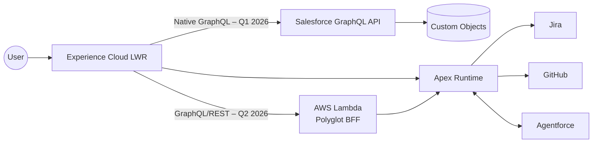

# Ryan Bumstead – Salesforce Platform Architect Portfolio

**Current Site** → https://ryanbumstead.com (placeholder only)
**Full MVP Launch** → Q1 2026
**Phase 8 Multi-Cloud** → Q2 2026

> This repository contains the **complete enterprise architecture** for a production-grade Salesforce portfolio that will launch in Q1 2026.
> The documentation is finished today — the code is coming.

## Full Architecture Documentation (Ready Now)

| Document                                          | Status   | Link                                           |
| :------------------------------------------------ | :------- | :--------------------------------------------- |
| **01 – Executive Overview**                       | Complete | [Read →](docs/guides/01-Executive-Overview.md) |
| **02 – Program Charter & Roadmap**                | Complete | [Read →](docs/guides/02-Program-Charter.md)    |
| **03 – Systems Architecture Specification (SAS)** | Complete | [Read →](docs/guides/03-SAS.md)                |
| **04 – Technical Implementation Guide**           | Complete | [Read →](docs/guides/04-Technical-Guide.md)    |
| **05 – Maintenance & Operations Guide**           | Complete | [Read →](docs/guides/05-Maintenance-Guide.md)  |

## Planned Architecture (North-Star)

